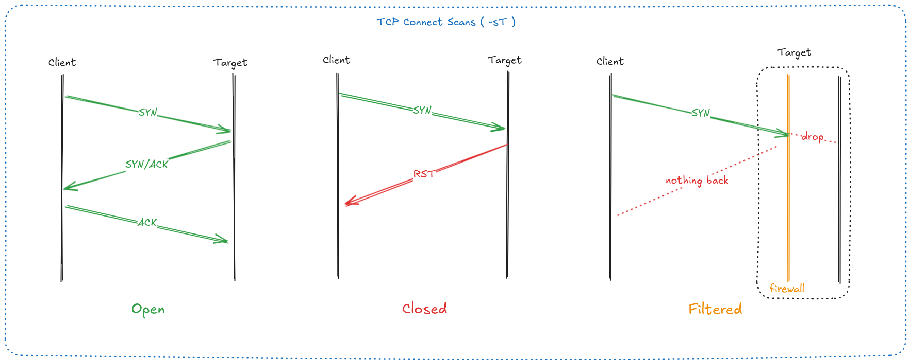
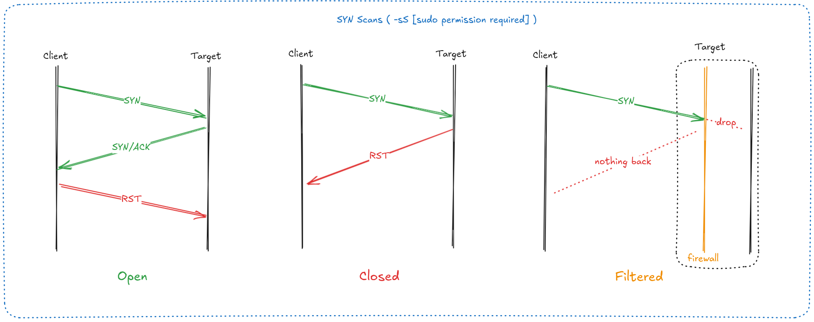
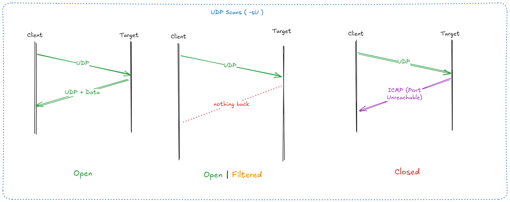

import { Aside } from 'astro-pure/user'

## Các loại scan phổ biến

### TCP Connect Scans (-sT)

```bash
nmap -sT target
```

It uses the operating system's network functions to establish a full TCP connection with the target. This method is less stealthy than SYN scans but can be used when SYN scans are not possible.



A full TCP connection involves the three-way handshake process, which involves sending a SYN packet, receiving a SYN-ACK response, and then sending an ACK packet to establish a connection.


And if the port is closed, it will respond with a RST packet, indicating that the connection was refused.

However, there is a third possibility where the port is filtered, meaning that it does not respond to the SYN packet at all. This can occur when a firewall is blocking the connection or when the target is configured to drop packets from certain sources.

For example, in IPtables for Linux, you can use the following rules to filter incoming traffic:

```bash
iptables -A INPUT -p tcp --dport <port> -j DROP -j REJECT --reject-with tcp-reset
```

### SYN Scans (-sS)

```bash
nmap -sS target
```

SYN scans, also known as *"half-open"* scans or *"stealth"* scans, send a SYN packet to the target port. If the port is open, it responds with a SYN-ACK packet. The scanner then sends an RST packet to terminate the connection before it is fully established, which can help avoid detection.



Some advantages of SYN scans include:
- Faster than TCP connect scans because they do not complete the full TCP handshake.
- They are less likely to be logged by the target system, making them more stealthy.
- It can used to bypass older Intrusion Detection Systems (IDS) that may not log half-open connections.

However, a couple of disadvantages include:
- They require root privileges to run on most systems, as they need to send raw packets (as opposed to the full TCP handshake).
- Unstable services are sometimes brought down by SYN scans, which could prove problematic in certain scenarios like a client has provided a production environment for the test.

For these reasons, SYN scans are the default scan type in Nmap when run with root privileges. If run without root privileges, Nmap will automatically fall back to using [TCP connect scans](#tcp-connect-scans--st). 

<Aside title="Note">
SYN scans can also be made to work by giving Nmap the `CAP_NET_RAW`, `CAP_NET_ADMIN`, `CAP_NET_BIND_SERVICE` capabilities; however, this may not allow many of NSE scripts to run properly.
</Aside>

### UDP Scans (-sU)

```bash
nmap -sU --top-ports 20 target
```

Unlike TCP, UDP connections are stateless. They don't require a handshake to establish a connection, which makes them more difficult to scan. When scanning UDP ports, Nmap sends a UDP packet to the target port and waits for a response.



If the response is nothing at all, it could mean that the port is open or filtered. If the port is closed, the target will respond with an ICMP "port unreachable" message. If it get a respone, it means the port is open and accepting connections (which is very unusual).

UDP scans so slow, therefore, it is recommended to use the `--top-ports <number>` option to limit the number of ports scanned. This option allows you to specify the number of most common ports to scan, which can significantly speed up the scanning process.

### ICMP Network Scanning (-sn)

```bash
nmap -sn target-range # e.g., nmap -sn 192.168.1-254
```

ICMP network scanning, also known as "ping scanning," is a technique used to determine if a host is active on a network. When you run the `nmap -sn` command, Nmap sends ICMP Echo Request packets (commonly known as "ping" packets) to the target host. If the host is active and reachable, it will respond with an ICMP Echo Reply packet.

### NSE 

The Nmap Scripting Engine (NSE) allows users to write and execute custom scripts to automate various tasks during a scan. NSE scripts can be used for a wide range of purposes, including vulnerability detection, service enumeration, and even brute-force attacks.

To use NSE scripts, you can specify the script category or individual scripts with the `--script` option. For example, to run all default scripts against a target, you can use:

```bash
nmap --script=default target
```

Nmap scripts come with build-in helps menu, which can be accessed using the `--script-help` option. For example, to get help on the `http-enum` script, you can run:

```bash
nmap --script-help=<script-name>
```

## References

- [Nmap Official Documentation](https://nmap.org)
- [For more Nmap command examples, check out this cheat sheet [Accessed: 2026-18-06]](https://stationx-public-download.s3.us-west-2.amazonaws.com/nmap_cheet_sheet_v7.pdf)
- [NSE Usage](https://nmap.org/book/nse-usage.html)